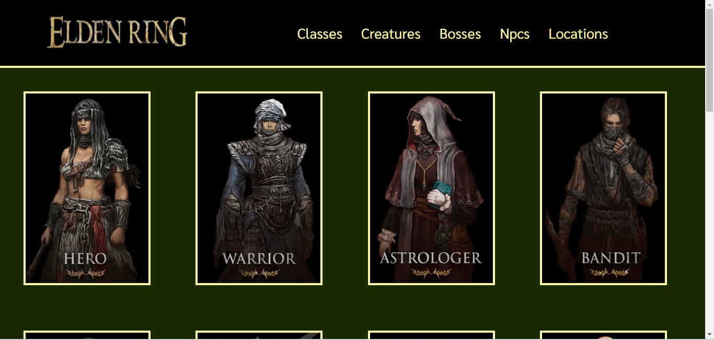

# Elden Ring API

[Clique aqui](https://elden-ring-eight.vercel.app/classes) para acessar o site.
---
## Sobre
Um pequeno projeto consumindo uma API escolhida (no meu caso a https://eldenring.fanapis.com/) com o intuito de praticar o consumo de API 
para criação de sites, além de aprender a utilizar WebComponents e rotas (Routes). O objetivo deste projeto é colocar em prática os conhecimentos adquiridos no curso do [SENAI Jandira](https://jandira.sp.senai.br/).
---
## Figma
[Clique aqui](https://www.figma.com/file/icgCMOZlcwDc0WeeZF71lq/Elden-Ring?type=design&node-id=0-1&t=FxzNv0SmLJzSrpb1-0) para acessar o projeto do Figma

---
## Tecnologias utilizadas
- HTML5
- CSS3
- JavaScript
- Figma
- Router
- Web Components
- Markdown

---
## Autor
- [Mateus Alves](https://github.com/MateusAlves595)

---
## Professor
- [Fernando Leonid](https://github.com/fernandoleonid)